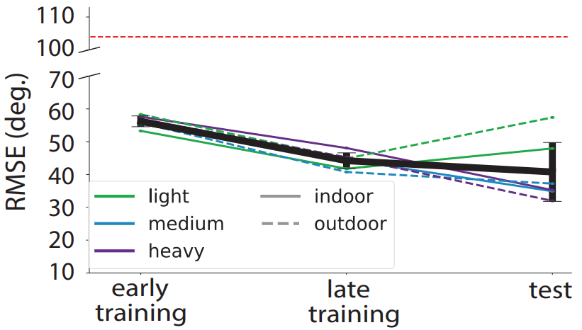
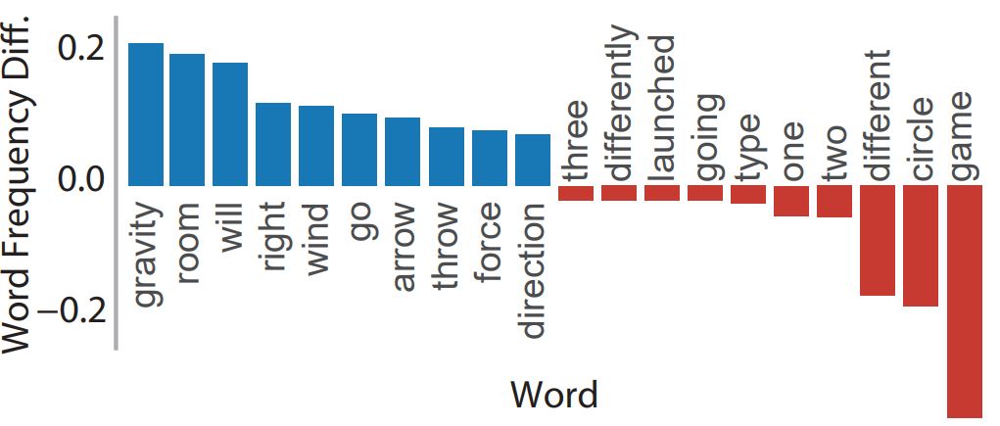
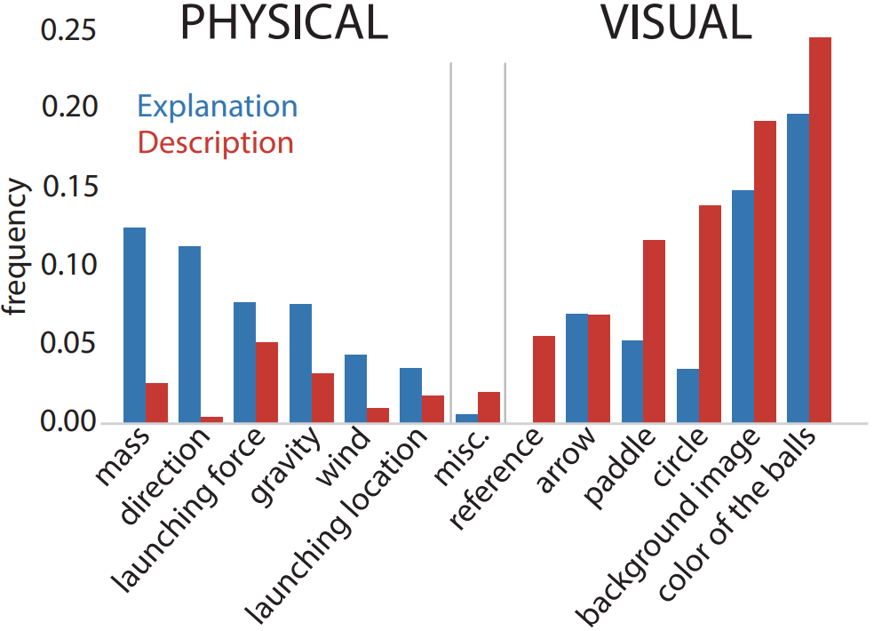

# Communicating understanding of physical dynamics in natural language

Language is a powerful vehicle for communicating what we perceive and know about the external world. We can talk not only about observable properties of objects in our surroundings, but also their latent physical properties and predictions about how they will behave. Nevertheless, little is known about what characterizes language about physical properties, and distinguishes it from language about static visual properties.

## Physics game experiment

To address this gap, we conducted an online behavioral experiment in which participants (N = 238) first played a physics-based video game, then wrote about their experience. The game required participants to learn how to predict where a ball would fly when launched under different conditions. Half of the participants were prompted to explain to someone how the game works (Explanation group); the remaining participants described how the game interface looked (Description group).

We manipulated the following variables in each trial: the environment where the participants preform this task, the mass of the ball, the location where the ball was launched, and the force the ball was launched with. In order to introduce different latent forces that require different predictions to maintain high accuracy, we used two environments cued by different background images. In one environment, there is only gravity pulling downward (Fig.1); and in the other environment, there is both a downward gravity force and a rightward wind force (Fig.2). As these forces are evocative of indoor/outdoor environments, we use the indoor/outdoor nomenclature for simplicity throughout the paper. To elicit participants' inferences about physical parameters, we used three types of balls: light, medium and heavy. All balls are the same size, but have different colors and textures, allowing participants to learn a color/texture to mass mapping throughout the experiment (Fig.3).

Fig.1 - Outdoor game trial demonstration

Fig.2 - Indoor game trial demonstration

Fig.3 - 2x3 Design Matrix

## Natural Language Elicitation

After the participants have finished the game, they were randomly assigned to either explain or to describe, resulting in 119 participants in each condition. In the explanation condition, they were given the following prompt: “Imagine someone who has never played this game before but is interested in learning how to play. What would you tell them so that they understand where to put the paddle on any given trial? Please write a short paragraph that provides them with the most important information to help them succeed.”

In the description condition, they were prompted to: “Imagine someone who has never played this game before but is interested in picking it up at the store. What would you tell them so that they could identify it based on a few screenshots? Please write a short paragraph that provides them with the most important information to help them pick out this game from a lineup of other similar-looking ones.”

## Results
### How well can people play this game?

Fig.4 - Participants' Game Performance

Overall, participants' predictions improved over time.

### How are explanations different from descriptions?

Fig.5 - Differences in Word Frequencies between Two Conditions

Words about physical concepts were more often mentioned in explanations.

### How are explanations different from descriptions?

Fig.6 - Latent Embeddings of Language

There's a high degree of separation between the embeddings of explanation and description extracted from large language models.

### How well do the concepts people mentioned correspond to the task environment?

Fig.7 - Difference of Normalized Word Frequency between Conditions

Explanations included more information about physical concepts, while still mentioning relevant visual attributes.

### How does the content of explanations relate to task performance?

Fig.8 - Physical Concepts x Game Performance

Participants who performed well in the game mentioned more physical concepts compared to those who performed less well.
## How to navigate this repository

See `/experiments/index.html` for our web experiment. This experiment was built using JsPsych: <https://www.jspsych.org/7.2/>

• `/experiments/js/` contains JsPsych plugins, as well as custom written plugins (e.g., `jspsych-intuitive-physics.js`)  
• `/experiments/js/setting.js` is the main js file that set up the experiment  
• `/stimuli/` contains the file that generates physics game trials  
• `/analysis/analysis.ipynb` contains analysis scripts  
• `/analysis/results/csv/` contains anonymized CSVs data files for all participants  
• `/analysis/results/json/` contains anonymized tagged language responses for all participants  
